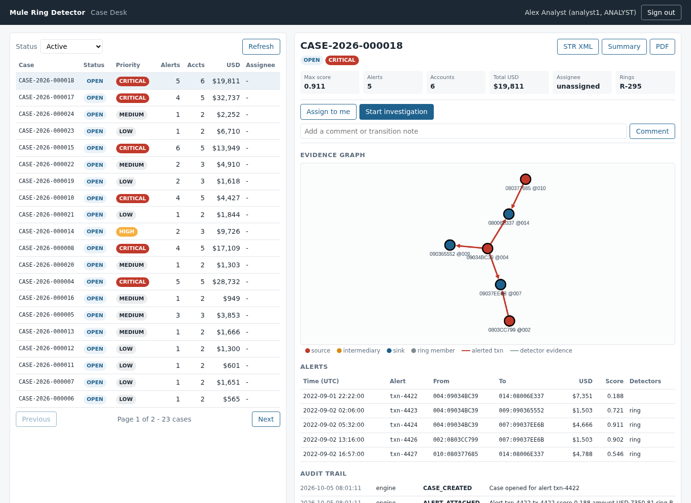
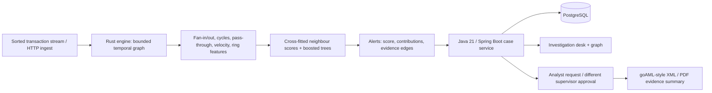

# mule-ring-detector

A streaming money-mule detector in Rust with a Java investigation desk: temporal graph
features, explainable model scores, account-ring evidence, case grouping, and a two-person
approval workflow for suspicious-transaction reports.

**Personal portfolio project.** All demonstrations use synthetic transactions. The measured
evaluation uses IBM's public AMLworld HI-Small benchmark, not customer banking records. The
reports are illustrative and are not submitted to any regulator.



[Recorded investigation-desk demo](docs/demo.webm)

## Architecture



| Component | Implementation |
|---|---|
| `mrd-core` | Event-time graph with a 96-hour window, capped adjacency, bounded cycle search, ring rebuilding, 33 features, logistic regression and gradient-boosted trees. |
| `mrd-eval` | Time-based train/validation/test splits, validation-selected thresholds, transaction-only ablation, rule baselines, precision/recall and pattern-level evaluation. |
| `mrd` CLI | Dataset preparation, training, evaluation, latency/memory benchmarks, CSV replay with HTTP alert delivery, and a live transaction-ingest API. |
| `case-service` | Idempotent alert ingestion, overlapping-case merging, role-controlled workflow, audit history, evidence graphs, XML/PDF reports, and separate requester/approver identities. |

The transaction label is never read by the online detectors or scorer. Neighbour risk uses
first-stage models trained on separate account folds during training. Thresholds and tree
selection use validation; test results are reported after model selection is frozen.

## Measured results

The IBM HI-Small file contains **5,078,345 synthetic transactions**. The split is chronological:
training before 2022-09-07, validation through 2022-09-08, test from 2022-09-09. No random split
mixes future transactions into training.

Full test window: 863,900 transactions, including 1,611 labelled laundering transactions.

| Model | Precision | Recall | F1 | Average precision | Alerts per 10k transactions |
|---|---:|---:|---:|---:|---:|
| Graph features + boosted trees | 0.581 | 0.570 | 0.576 | 0.579 | 18.3 |
| Graph features + logistic regression | 0.563 | 0.516 | 0.539 | 0.523 | 17.1 |
| Transaction-only boosted trees | 0.148 | 0.333 | 0.205 | 0.100 | 42.0 |
| Amount rule | 0.009 | 0.017 | 0.011 | 0.004 | 38.0 |

The primary model detects at least one transaction in **94.0% of the 183 patterns ending in
the full test window**. This is pattern recall, not transaction recall. Alert-cluster precision
is only 26.1%; graph grouping does not remove the need for analyst review.

The dataset has a sparse late tail with a different positive rate. The separately reported
test window ending on 2022-09-11 gives precision **0.398**, recall **0.439**, and F1 **0.417**.
Both windows are retained in [the complete evaluation](reports/eval.md); the stronger full-window
number should not hide this sensitivity.

Single-thread replay of all 5,078,345 transactions: **19,761 transactions/s including CSV parsing**,
engine p50 **35.9 µs**, p99 **91.6 µs**, p99.9 **1.36 ms**, maximum **242 ms**. Peak RSS is **487 MiB**,
including the latency sample buffer; estimated graph state peaks at **283 MiB**. These are
development measurements on a shared 8-vCPU Broadwell-class VPS with 23 GB RAM, not a production
capacity claim. See [raw benchmark data](reports/bench.json) and [training metadata](reports/train_report.json).

## Quick demo

Requires Rust stable, JDK 21, Python 3 and curl. Maven is supplied by the wrapper. The demo
trains on the small checked-in synthetic fixture, sends scored alerts from Rust into the Java
service, and leaves the investigation UI open until Ctrl+C. No dataset download or database
server is required: the local profile uses an isolated in-memory H2 database.

```bash
scripts/demo.sh
# Open http://localhost:8085/ and sign in as analyst1 / analyst1-dev.
# Or run the pipeline, assert that cases were created, then stop:
scripts/demo.sh --check
```

These are deliberately public local-demo credentials. Do not use the local profile on a shared
network. Runtime PostgreSQL configuration and the complete API are documented in
[case-service/README.md](case-service/README.md).

## Reproduce the full benchmark

```bash
scripts/fetch-data.sh
cargo build --release
target/release/mrd prepare --input data/HI-Small_Trans.csv \
  --output data/HI-Small_sorted.csv --splits data/splits.json
target/release/mrd train --input data/HI-Small_sorted.csv --splits data/splits.json \
  --out-dir models --neg-rate 0.1 --trees 500 --depth 4
target/release/mrd eval --input data/HI-Small_sorted.csv --splits data/splits.json \
  --models-dir models --patterns data/HI-Small_Patterns.txt \
  --test-end 2022-09-11T00:00 --out-dir reports
target/release/mrd bench --input data/HI-Small_sorted.csv \
  --model models/gbdt.json --out reports/bench.json
```

The downloader uses a public mirror and checks both files' SHA-256 values. Canonical dataset
information: [IBM AML-Data](https://github.com/IBM/AML-Data) and
[Altman et al., NeurIPS 2023](https://research.ibm.com/publications/realistic-synthetic-financial-transactions-for-anti-money-laundering-models).
The dataset is separately licensed under **CDLA-Sharing-1.0**; this repository does not include
the downloaded dataset or trained models. The checked-in test fixture is generated by this
project's own synthetic generator.

## Checks

```bash
cargo fmt --all --check
cargo clippy --workspace --all-targets -- -D warnings
cargo test --workspace
(cd case-service && ./mvnw -B verify)
```

CI runs these checks and trains/evaluates the small synthetic fixture. Tests cover temporal
graph eviction, detector evidence, codec/property checks, HTTP ingest, alert idempotency, case
merging, workflow restrictions, audit immutability, report validation, and role separation.

Verified locally on 2026-10-05: **34 Rust tests and 59 Java tests**, no skips or
failures. The fixture demo emitted 50 scored alerts and created investigation cases through
the real HTTP integration. A browser check verified sign-in, open-case detail and the evidence
graph with no page errors or failed network requests.

## Limitations and design choices

- Synthetic benchmark performance does not establish accuracy on real banking activity.
- Capped adjacency and bounded cycle search trade detection completeness for predictable work.
  The account interner remains unbounded; graph state has no crash checkpointing.
- Replay sorts by event time. Live out-of-order events are clamped; there is no upstream
  reorder buffer, distributed ingestion, or exactly-once delivery system.
- Frozen FX approximations normalize amounts; no live market-rate or sanctions service exists.
- Case grouping is serialized within one service instance. Multiple instances need database
  coordination, and the audit trail is append-only in the application, not tamper-proof storage.
- The local UI uses HTTP Basic authentication and a CDN graph library. Production identity,
  transport security, monitoring and regulated report schemas require further work.

[docs/design.md](docs/design.md) explains the algorithms, model selection, complexity, evidence
attribution, and the false-positive trade-offs.

## License

Code: MIT, [LICENSE](LICENSE). IBM's dataset has its own license as described above.
